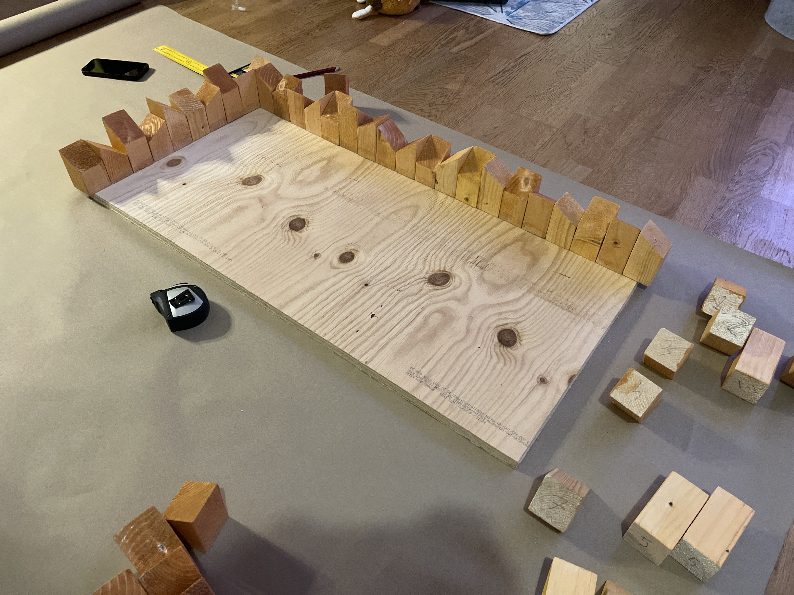
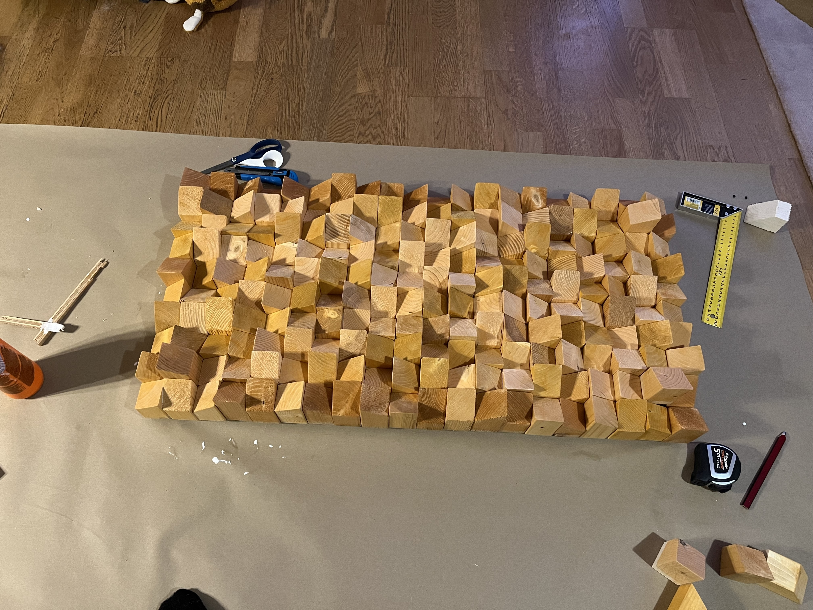

{{ toc() }}

## Home

- Dog dug up the yard and the new grass. Multiple times even. Planted some clovers to hide the bald spot. Fixed up a vine that fell down from the wall.
- Painted some rooms. The previous owner left them in a sorry state.
- Built a little bathroom shelf, a little nightstand and a sound diffuser. Getting the hang of woodworking.

<label>The sound diffuser being built.</label>

## Relationship

- Got engaged!

## Quests

I remember seeing some blog post somewhere that advocated, possibly a bit ironically, the concept of using **main quests**, **side quests** and **daily quests** in tracking your to-dos. I decided to give them a try. I now use main and side quests to keep track of my higher level objectives. These objectives function at the week or month level. I do not use daily quests.

I’ve always found it hard to stick to to-do tracking schemes. They are often too complex and unable to track priorities or time spans in a way that would feel natural. Maybe this approach is simple and video-gamey enough to stick.

## Live music 🤘🏻

- Valkeat, Ethereal Sin @ Lepakkomies
- Queendyster, Liturgy @ Kuudes Linja
- Havukruunu, Satanic North @ Tavastia

## Video games

Played:

- Outer Wilds (this was a good game) and the DLC (not entirely my vibe)
- Plucky Squire
- Neon White

Enjoyed watching:

- Metal Gear Solids 1–4 in [Giant Bomb longplay format](https://www.youtube.com/playlist?list=PLXlhzeWIuTHLfGvMnnWLJK3DRLQwcTpwd)
- Ultrakill

## Career

- Finished some certifications: _GCP-ACE_, _AZ-900_, _AI-900_.

## Reading

- Still reading _Designing Data-intensive Applications_. Got sidetracked by a database project that was inspired by the book.

## Top tunes

- Djennaration – Liturgy
- The Ultrakill OST

## Previous update

- [🌞 Now, summer 2024](/posts/now-2024-summer)
