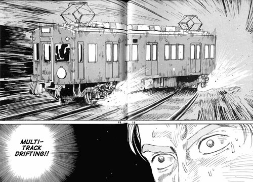

Got married! Broke my elbow while bouldering, writing this on sick leave. Added Gemini capsule version of this site.

{{ fig(src="joopo_wedding.jpg", alt="Jojo looked presentable at the wedding 🎀" )}}

{{ toc() }}

## Wedding and new surname

I got married to my wife Marika in August after 15 years together. The day was better than I could have ever imagined. The weather was great and my bride was stunning. We both remembered our vows without a single stutter. Incredible photos with 60 of our closest friends and family members. Delicious food and drink.

There were small mishaps with the schedule and forgotten little things here and there, but they pale in comparison to everything that went right.

We chose a new surname. We are now the only two people with the name Sydänviita. It stands roughly for "heart of the thicket".

## Climbing and injury

I've got into sport climbing during the the summer. That's the indoor kind, with the rope and harness. I started at grade 5a, and worked up to a 6b max grade. My goal was to top a 6c during 2026. But then...

I fell on my arm while bouldering and broke my elbow. It's going to take a couple of months to heal, and probably longer to get back to climbing condition. The surgery went well and I should make a full recovery. Safe to say that the 6c dream can wait!

I think I'll let others do the bouldering in the future. I'll stick to dangling on the rope.

## Running

I also picked up running. I haven't really succeeded in making it a habit, but I managed to run 5K though, after a couple of months!

I might focus on running while my arm heals.

I also learned that a running shoe should be a couple of (EU) sizes larger than your regular everyday shoe size.

## Updates to the website

I use [Syncthing](https://syncthing.net) liberally to keep my documents and non-code projects backed up and synced between my phone, laptop and home server. It works over the internet too with Wireguard VPN enabled.

I sync my development copy of this blog to my phone too. That way I can write posts on the go.

My [first deployment process](/posts/deploying-the-garden/) was based on a very similar setup, but this time around the syncing is not related to deployment at all. Just authoring.

I still use Obsidian on iOS to write Markdown, since it's the best `.md` editor I've found.

## Gemini capsule

There's also a Gemini version of this site now, also known as a _capsule_ in Gemini parlance, available at [`gemini://jan.systems`](gemini://jan.systems). You need a Gemini browser to view it. I use [Lagrange](https://git.skyjake.fi/gemini/lagrange). See Gemini [FAQ](https://geminiprotocol.net/docs/faq.gmi).

I jerry-rigged Zola to make a Gemtext build of the site alongside the html build. I use the [agate](https://github.com/mbrubeck/agate) server to serve the site from my home server.

## Home server

I've set up quite a bunch of services on the server. It's nice to have personal computing running on personally owned hardware. Everything's chugging along super well. I'll try to write separate posts about the interesting parts.

## New laptop

I got a new 16" MacBook Pro with the M5 Pro chip and 64 gigs of RAM. It's been sweet. Really overkill for most of the stuff I do on it, but considering how heavy all desktop software is nowadays, it's good to have some headroom. I can experiment with local LLMs too.

## Games

**Finished**

- The Messenger. Banger soundtrack, nice precision platformer romp.
- Mina the Hollower. Love it. Fantastic soundtrack.
- Split Fiction. Mid.

**Started**

- Ball x Pit. Probably not going to continue; incremental roguelites don't really do it for me anymore. 
- Denshattack! Feelings summarized by image below.

## Music

### SOAD tour

I saw System of a Down in Stockholm with my wife. We travelled there a couple of days before to do some sightseeing. Our actual vacation days were tied up in wedding prep, so this was a nice mini-holiday.

The gig was at Strawberry Arena. The place was packed!

The opening acts Acid Bath and Queens of the Stone Age were okay, not really a fan of either.

The main act, however, was insane. The whole arena was singing along to pretty much every tune. Happy to have seen them live!

{{ fig(src="gig.png", alt="People on the floor look like ants." )}}

### Dungeon synth live practice

A DS community I'm part of was talking about a low-fi, no-mains-electricity, cave gig in the Suomenlinna dungeons. Very punk and DIY. Sadly it never came to be.

Me and Juuso (aka [Blek](https://blekmusik.bandcamp.com/album/m-rkret-efter-soluppg-ngen)) practiced a bit for the hypothetical gig though. It was nice to see that our EP material could be arranged to two battery-powered keyboards quite well.

### Top tunes

I've been digging this doom metal outfit called Faetooth lately.

{{ bandcamp_embed(album_id="2239340294", album_url="https://faetooth.bandcamp.com/album/labyrinthine", text="Labyrinthine by Faetooth") }}

## Anime & movies

- Pom Poko (movie)
- Finished the 300 fansubbed Chiikawa episodes that I could find
- Started Nier Automata anime
- Started the new Ghost in the Shell anime
- Started CITY The Animation to scratch the Nichijou itch

## Previous update

- [🌱 Now, spring 2026](/posts/now-2026-spring)
